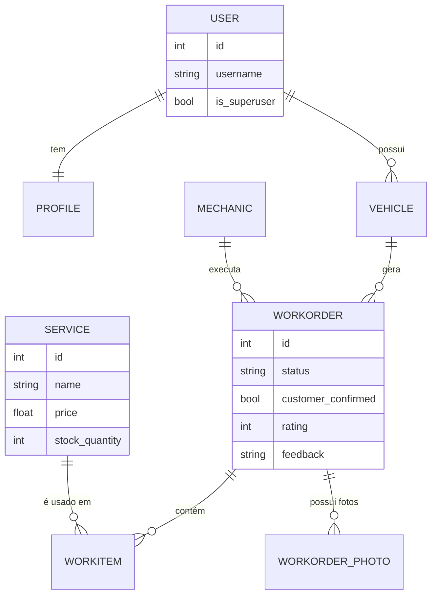

# Diagrama do Banco de Dados — MechManager (Versão FastAPI + React)

O **MechManager** utiliza um modelo relacional robusto, implementado via **SQLModel**, projetado para suportar uma arquitetura de API REST.

O banco de dados (SQLite) foi expandido para suportar funcionalidades modernas como **controle de estoque**, **uploads de fotos** e **avaliação de serviço**.

---

## Estrutura Conceitual

| Entidade           | Descrição                                                                         |
| ------------------ | --------------------------------------------------------------------------------- |
| **User**           | Usuário do sistema. Possui flag `is_superuser` para diferenciar Admin de Cliente. |
| **Profile**        | Extensão do usuário (1:1) contendo foto de perfil, telefone e biografia.          |
| **Vehicle**        | Veículo pertencente a um cliente.                                                 |
| **Mechanic**       | Funcionário responsável pela execução da OS.                                      |
| **Service**        | Catálogo de serviços e peças. Agora inclui **Quantidade em Estoque**.             |
| **WorkOrder**      | A Ordem de Serviço (OS). Controla status, total, avaliação (NPS) e datas.         |
| **WorkItem**       | Item da OS (Peça/Serviço x Quantidade x Preço Unitário).                          |
| **WorkOrderPhoto** | Fotos de acompanhamento do serviço (Antes/Depois) vinculadas à OS.                |

---

## Diagrama ER (Mermaid)

